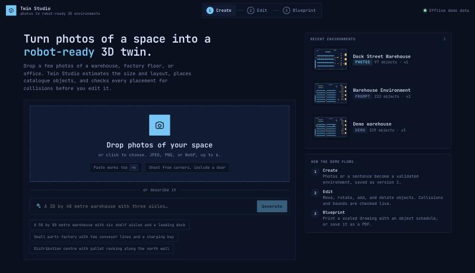
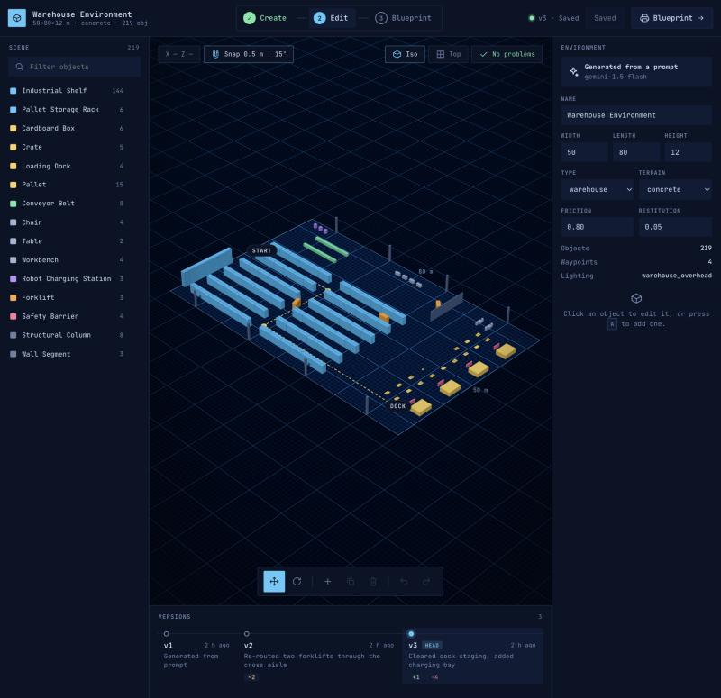
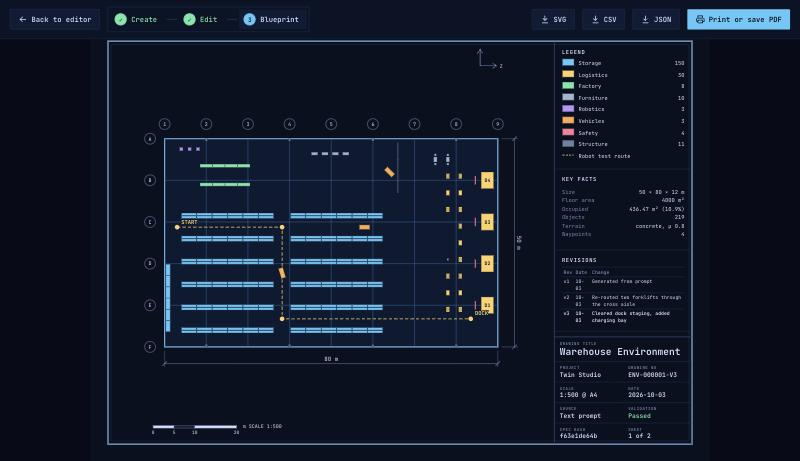

# Twin Studio

Twin Studio turns photos or one sentence into a 3D environment for robot testing. You edit the environment in the browser, every save becomes a version in MongoDB, and you print the result as a scaled blueprint.

## How we use MongoDB

One Atlas cluster does all of it. The app has no second database, no vector store, and no embedding service.

| MongoDB feature | Where in the code | What it does for us |
|---|---|---|
| Document model | `environment_versions` collection | An environment is one nested document with its dimensions, terrain, objects, and waypoints. The LLM writes that JSON, the validator checks it, the editor changes it, and MongoDB stores it as it is. |
| Multi-document transactions | `runTx` in `apps/api/src/repository.ts` | A save inserts an immutable version and moves the head pointer in `environments`. Both writes commit together, with snapshot reads and majority writes. |
| Optimistic concurrency | `saveVersion`, plus the unique index on `{ environmentId, version }` | A save from a stale editor gets a `409` and cannot overwrite a newer version. |
| `$jsonSchema` validation | `apps/api/src/db/jsonSchema.ts` | Both collections reject a malformed document at the database, with `validationLevel: strict`. This is the second guard behind the app's own validator. |
| Atlas Vector Search with Automated Embedding | `apps/api/src/db/vectorIndex.ts` | Atlas embeds the summary of every saved version with Voyage AI. A search sends plain text. The app stores no vectors and needs no embedding code for it. |
| Aggregation pipeline | `buildSimilarPipeline` in `apps/api/src/similar.ts` | "Find similar environments" is one query. It runs `$vectorSearch`, filters by environment type, uses `$lookup` to keep only current versions, and ranks the hits. |

### Why MongoDB and not something else

- **The data is already a document.** A warehouse with 219 objects is one read and one write. In a relational schema the same scene spreads over several tables, and every load joins them back together.
- **History costs nothing extra.** Versions are immutable documents, so undoing a bad edit is a copy of an old version, and a transaction keeps the head pointer correct.
- **Search lives next to the data.** The vector index sits on the same collection that the transactions write. One pipeline searches by meaning, filters, and joins. With a separate vector database we would keep two systems in sync and could not do that in one query.
- **Atlas does the embedding.** With an `autoEmbed` index, a saved version becomes searchable with no work from the app. The similar search has no embedding step in our code.

## The website

The web app follows three steps.

**1. Create.** Drop photos of a space, or describe it in a sentence.



**2. Edit.** Move, rotate, add, and delete objects in 3D. The validator flags overlaps and out-of-bounds objects while you drag. Each save is a new version, and the timeline at the bottom opens any earlier one.



**3. Blueprint.** Print a scaled A4 plan with a legend, key facts, and the revision list.



## Run it

The web app starts on built-in demo data, so it needs no database.

```bash
npm install
npm run dev:web
```

Open `http://localhost:5173`.

To run it against MongoDB Atlas, copy `apps/api/.env.example` to `apps/api/.env`, set `MONGODB_URI`, and run these commands.

```bash
npm run db:init
npm run db:seed
npm run db:vector
npm run dev
```

Then open `http://localhost:5173/?api=http`.

`db:init` creates the collections, validators, and indexes. `db:seed` loads four demo scenes. `db:vector` creates the vector index.

## What is in the repo

```
apps/web            React and three.js app with the Create, Editor, and Blueprint screens
apps/api            Fastify API, MongoDB repository, LLM generation
packages/schema     Zod EnvironmentSpec, the contract every part shares
packages/catalogue  15 asset types
packages/validator  schema, reference, geometry, and physics checks
infra/mongo         Atlas and local setup notes
docs/api.md         API contract
```

`npm run test:unit` needs no database. `npm run test:api` uses an in-memory MongoDB, or the replica set in `TEST_MONGODB_URI` when you set it.

## Status

Text prompts go through the API. `POST /environments/generate` calls an LLM, repairs invalid output against the validator, and saves version 1. Photo input works in the web app on a preview generator. The vision endpoint is not built yet. "Find similar" is an API route, `GET /api/v1/environments/similar`, and has no screen yet.
